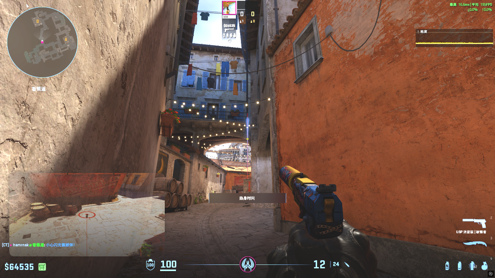
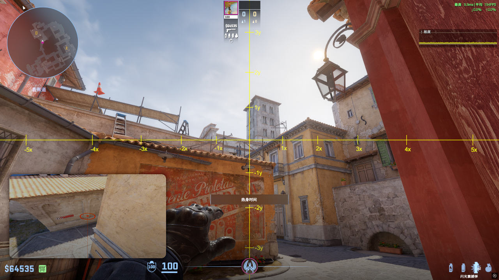

# de_inferno-T-Flashbang

## 1. 攻B

### 1.1. 石板闪

- 描点：

- 投掷方法：左键

### 1.2. 老九警家闪
看259丢的

- 描点：窗户偏左一点

- 效果：不白棺材，主白包点
- 注意事项：队友不能看警家

### 1.3. 香蕉道窗户闪
https://www.bilibili.com/video/BV1ERG2zLE5y?t=24.0

- 投掷方法：左键跳投

### 1.4. Jame石板辅助闪 ⭐
https://www.bilibili.com/video/BV1ERG2zLE5y?t=70.7
- 描点

- 效果：不白队友，清沙袋

### 1.5. 自助石板闪

https://www.bilibili.com/video/BV1ERG2zLE5y?t=79.8

### 1.6. Apex B 包点闪 ⭐
https://www.bilibili.com/video/BV1ERG2zLE5y?t=113.4

- 效果：不白队友，可以白棺材

### 1.7. 一箱辅助闪 ⭐
https://www.bilibili.com/video/BV1ERG2zLE5y?t=169.1

## 2. 攻A

### 2.1. device阳台闪 ⭐
https://www.bilibili.com/video/BV1ERG2zLE5y?t=298.5

### 2.2. G2单向闪 ⭐
https://www.bilibili.com/video/BV1ERG2zLE5y?t=318.3
