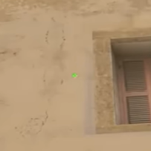
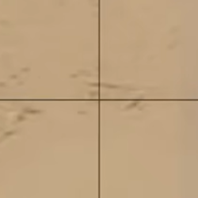
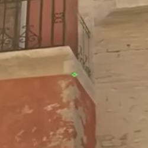
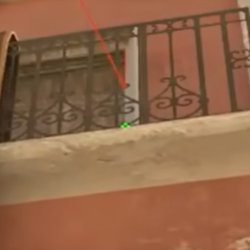
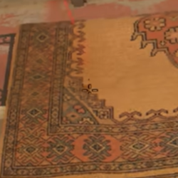
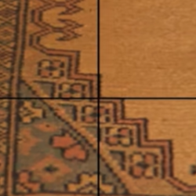
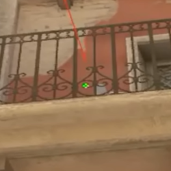

# `de_mirage` 🌪️

🌴🐫🌪️🎯🎯🎯🎯🎯🔫🕳🌴🐫🌪️

> 【可能是全网最实用的 荒漠迷城新手入门道具教学 进攻方篇！】 https://www.bilibili.com/video/BV1sWobYuEMZ/?share_source=copy_web


## 1. Tips

>【荒漠迷城公式化打法：中路夹A】 https://www.bilibili.com/video/BV1zWExzqEBY/

- 道具
  - 快烟
    - 对面有狙的时候要等烟爆
  - 沙袋后闪
  - 拱门内侧烟 (拱门上层烟) or B小烟
- 人数分配
  - 走中路，3人左右，人够的时候其中1个人可以走下水道
  - 走A1或者A2，2人左右
- 走位
  - 走中路
    - 出匪口的时候丢闪，增加有前压的情况的胜率
    - 中路往下走，贴左边可以头皮位边走边架b小，贴右边可以架拱门
    - 尽量不要往L位走，L位架b小不如走下面用头皮位架b小
    - 要小心下水道有CT、vip炸烟、跳b小、b小丢闪前压
  - 走下水道
    - 小心CT丢闪前压
    - 大部分时候可以大脚步踩，即使被CT听到也不影响，如果下水道太慢就帮不了中路
    - 如果看到下水道口有烟，记得通知队友小心前压
  - 上拱门
    - 育苗拱门内箱子
    - 贴右手搜左边
      - 上楼梯的时候一定不要走中间，不然会被B小打
    - 站起来看长箱或者b小，取决于道具怎么丢
    - 以上动作要快速做完，否则被没封烟的一边打
    - 看完跳到右手台子上，就可以防止被B小打
    - 如果丢的是拱门内侧烟，会玩的警察听到拱门的脚步会架这颗烟，所以1、可以出烟的时候给闪；2、可以故意放动静，等A区队友先动；3、可以在上拱门的时候不放动静，搞神秘
    - 如果丢的是B小烟，在育苗拱门的时候要小心警亭上架狙、jungle架狙、跳台架狙
  - 拱门进A点
    - 注意和A1 A2的队友同步
    - 如果丢的是拱门内侧烟，进A点可以静步往跳台摸，或者贴墙往jungle摸
  - A1 A2 进A点
    - 在中路队友还没就位时，选好位置架前压，保证自身存活
    - 可以帮中路队友丢<span data-tooltip-img="../../_images/image-132.png" style="border-bottom: 1px dashed #666; cursor: pointer;">Jungle烟</span>  


## 2. Instant Smokes

mirage VIP 快烟 VIP快烟

>【【Mirage】不是哥们2700了还不会扔快烟？】 https://www.bilibili.com/video/BV11YVUzwEFt/


### 1号位
- 1号位 后排最靠A的位置
- https://www.bilibili.com/video/BV11YVUzwEFt?t=48.6




### 2号位

- 2号位 后排最靠B的位置
- https://www.bilibili.com/video/BV11YVUzwEFt?t=78.1



### 3号位

- 3号位 中间一排最靠B的位置 
- https://www.bilibili.com/video/BV11YVUzwEFt?t=106.1



### 4号位

- 4号位 中间一排正对大写A下面箭头的位置
- https://www.bilibili.com/video/BV11YVUzwEFt?t=134.0




### 5号位

- 5号位 中间一排正对双拱形窗户的位置
- https://www.bilibili.com/video/BV11YVUzwEFt?t=178.2

 

- - -

## TOC 

```{toctree}
:glob:
./*
```