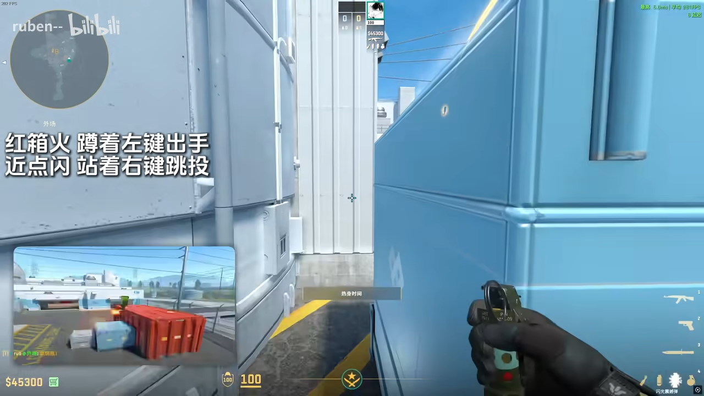
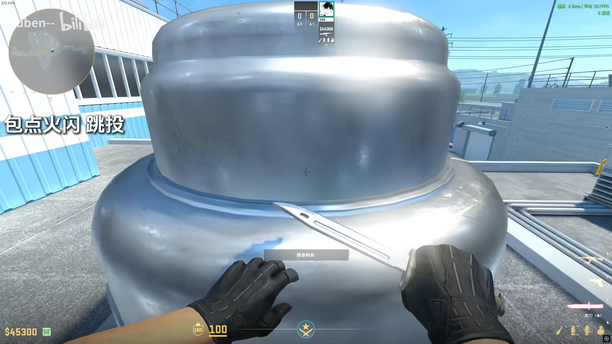
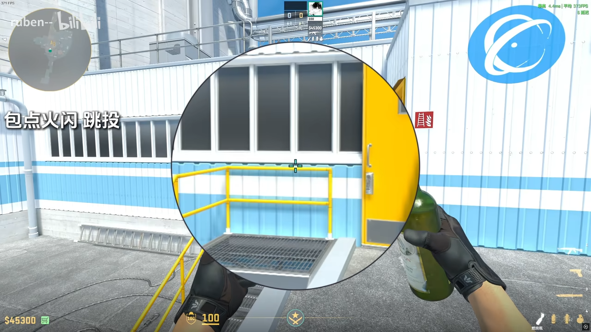
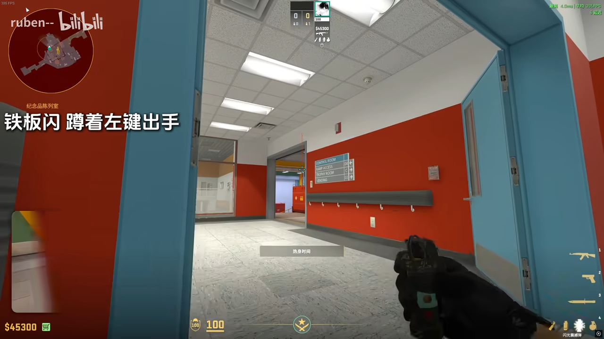
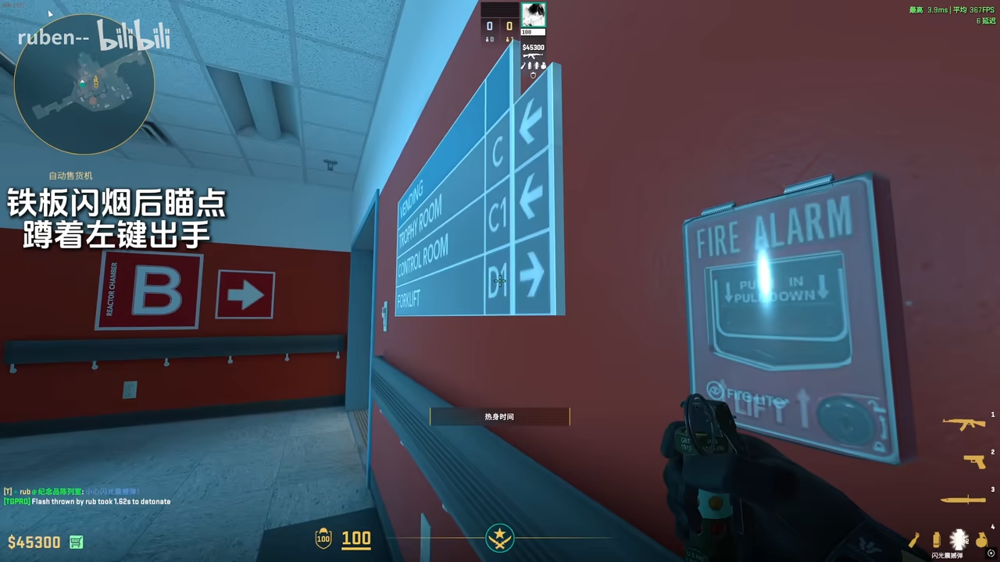
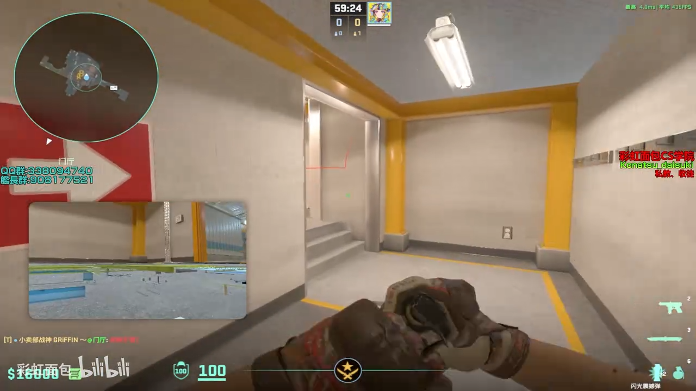
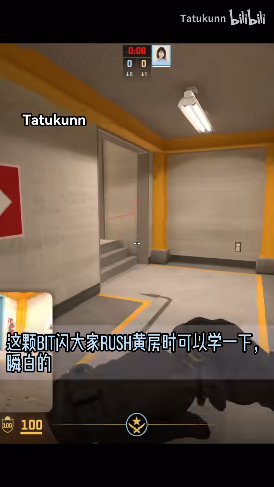
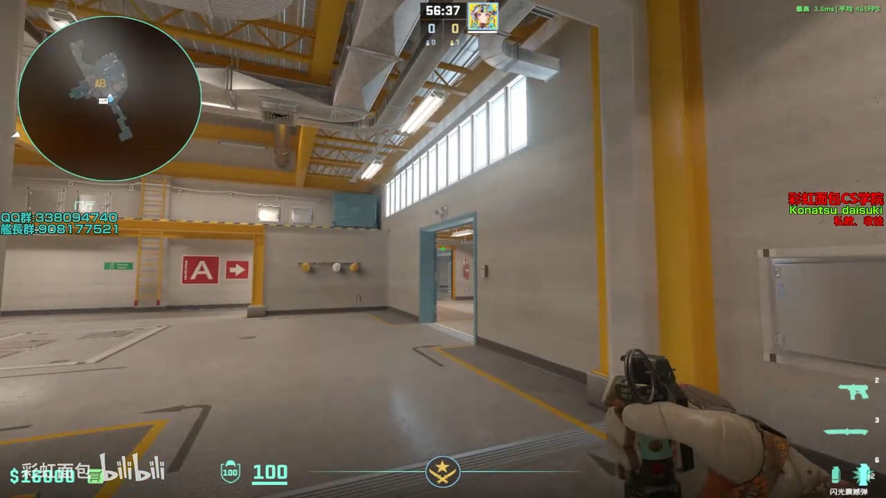
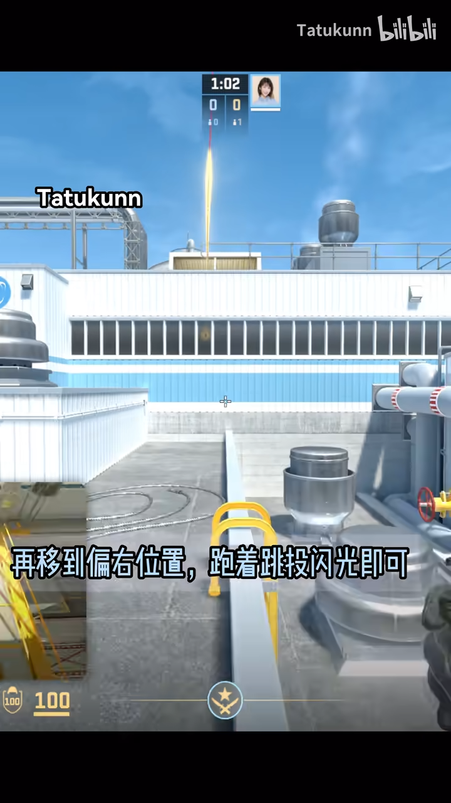

# de_nuke-T-Flashbang🌟
## 外场近点闪
https://www.bilibili.com/video/BV1xdNCzaEse?t=69.7

可以白凹槽

## 包点火+闪
https://www.bilibili.com/video/BV1xdNCzaEse?t=141.2

同个描点跳投火和闪

## 铁板闪 单向
https://www.bilibili.com/video/BV1xdNCzaEse?t=160.5

瞄远方的灯

<!-- 
有烟的时候可以瞄D1中间确认角度，然后再移动到爆弹位 -->

## 出黄房自助闪 丢法1
https://www.bilibili.com/video/BV1kzDXY9EWT?t=68.0

跑投

## 出黄房自助闪 丢法2
https://www.bilibili.com/video/BV1ukrxYvEyk?t=70.6

跑投

## 正门闪
https://www.bilibili.com/video/BV1kzDXY9EWT?t=92.6

跑投，在门炸开前一瞬间就可以出手

## rush内场 铁门闪
https://www.bilibili.com/video/BV1ukrxYvEyk?t=46.6
