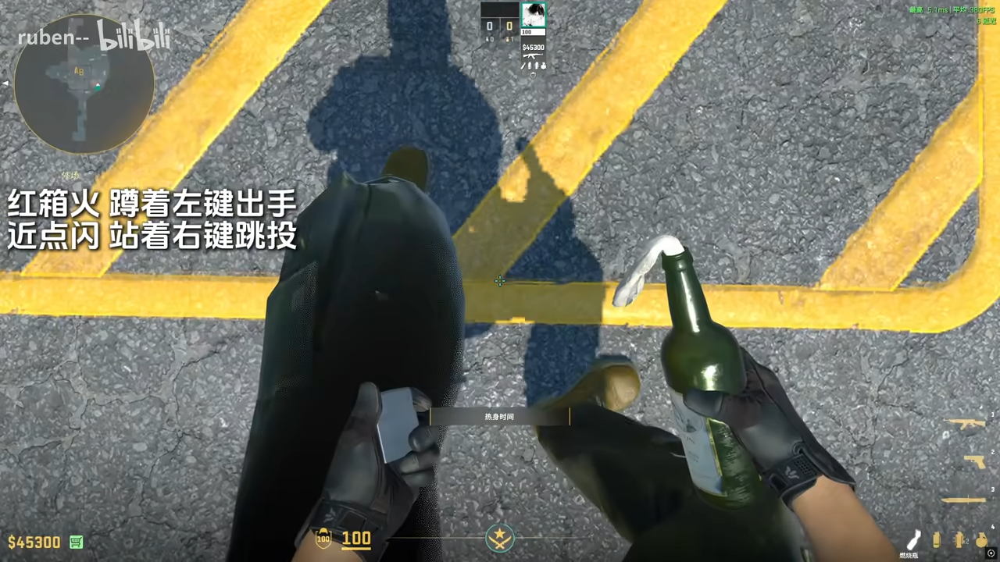
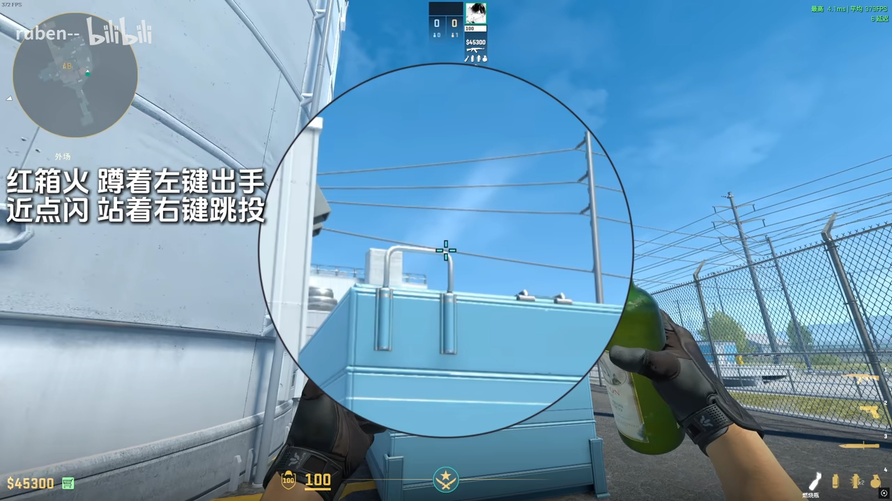
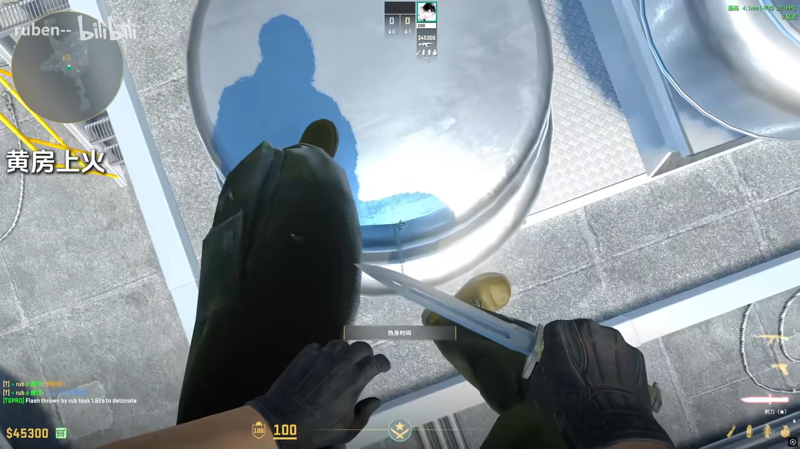
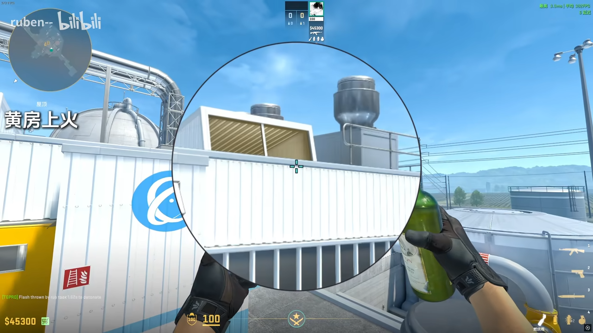
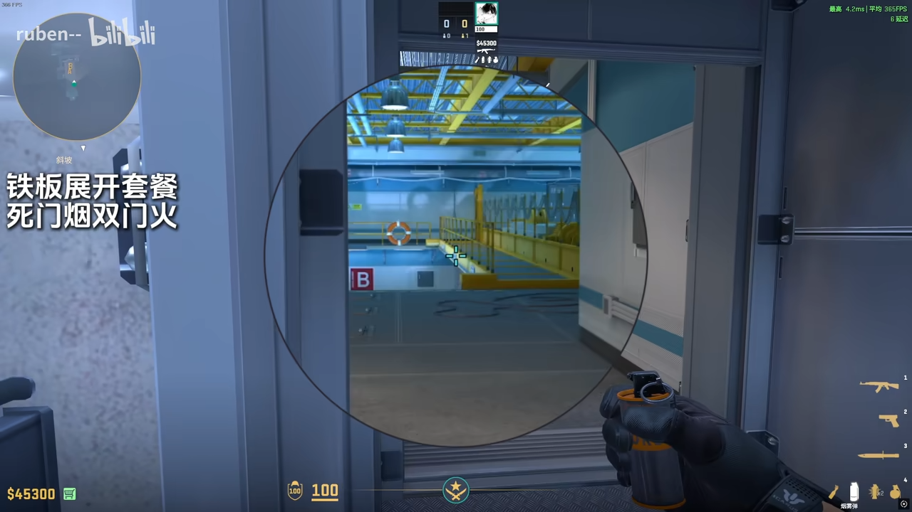
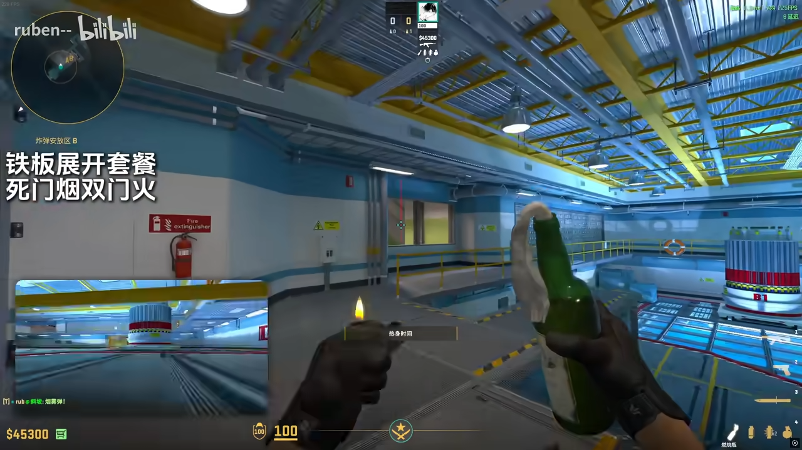

# de_nuke-T-Molotov🔥
## 红箱火
https://www.bilibili.com/video/BV1xdNCzaEse?t=64.2

站角上

蹲着瞄挂钩右上角左键

## 包点火+闪
https://www.bilibili.com/video/BV1xdNCzaEse?t=141.2

同个描点跳投火和闪

## 黄房上火
https://www.bilibili.com/video/BV1xdNCzaEse?t=150.1

**走一步投**

瞄上面大格子的下缘中间应该也可以

## 死门烟 双门火

https://www.bilibili.com/video/BV1xdNCzaEse?t=177.7

死门烟

双门火 跑步投（需要破窗）