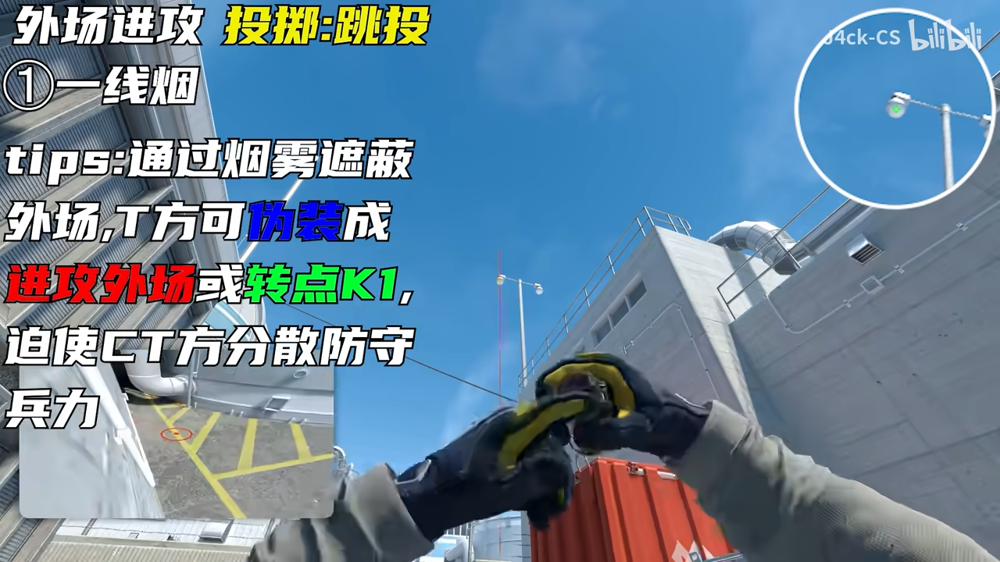

# de_nuke-T-Smoke-Grenade☁

## 一线烟 斜 丢法1
https://www.bilibili.com/video/BV1nYVgzmExM?t=2.6

站黄线顶墙

近烟瞄灯泡跳投

远烟瞄楼角跳投

## 一线烟 斜 丢法2
https://www.bilibili.com/video/BV1xdNCzaEse?t=5.9

顶灯柱左边

近瞄横竖交点跳投

远瞄横线偏右跳投

## 下管烟 常规 
https://www.bilibili.com/video/BV1xdNCzaEse?t=128.5

顶出门左手

第二根杆向上一点跳投

## 下管烟 进阶 快速

https://www.bilibili.com/video/BV15q7hzgESv/

瞄栏杆上，WA按着贴墙跑不松，过了墙上的一个坎后跳投

略抽象，可以看视频

## 死门烟 双门火

https://www.bilibili.com/video/BV1xdNCzaEse?t=177.7

死门烟

双门火 跑步投（需要破窗）

## 控制室展开套餐

https://www.bilibili.com/video/BV1xdNCzaEse?t=193.4

铁板右边烟

左边火

一颗闪

## 正门烟
https://www.bilibili.com/video/BV1kzDXY9EWT?t=92.6

跑投，在门炸开前一瞬间就可以出手