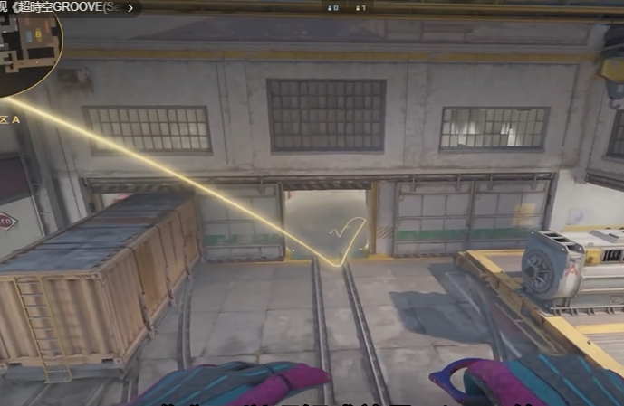
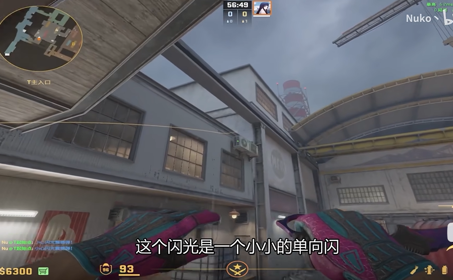
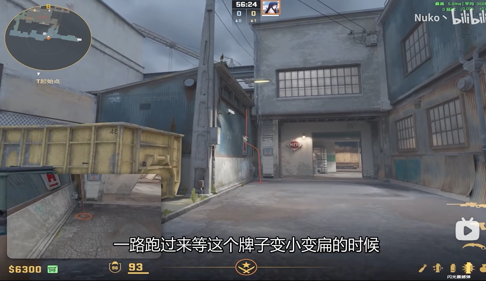
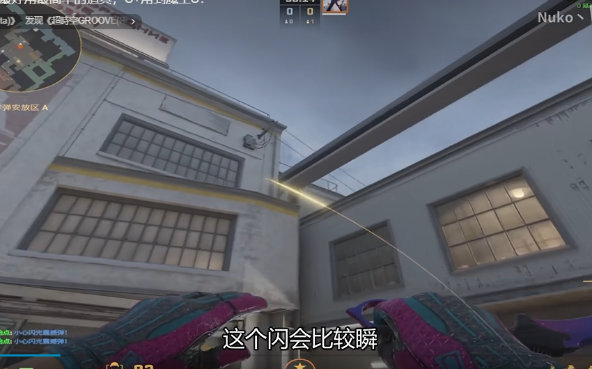
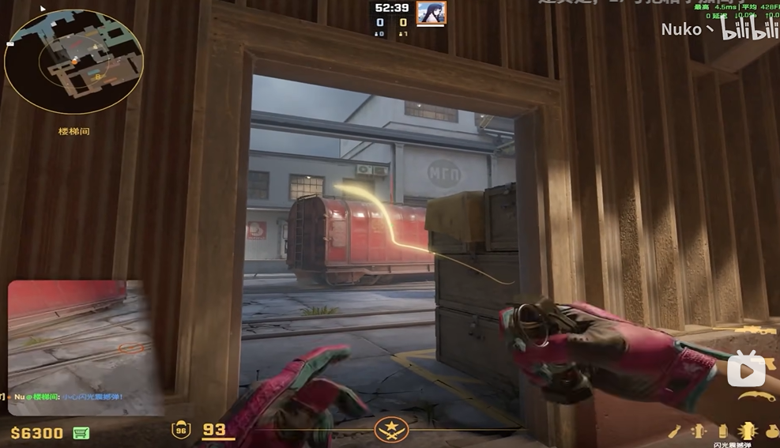
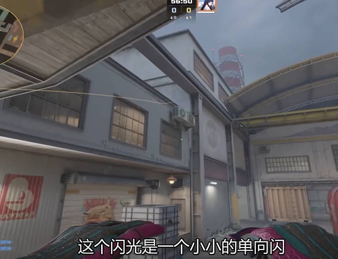
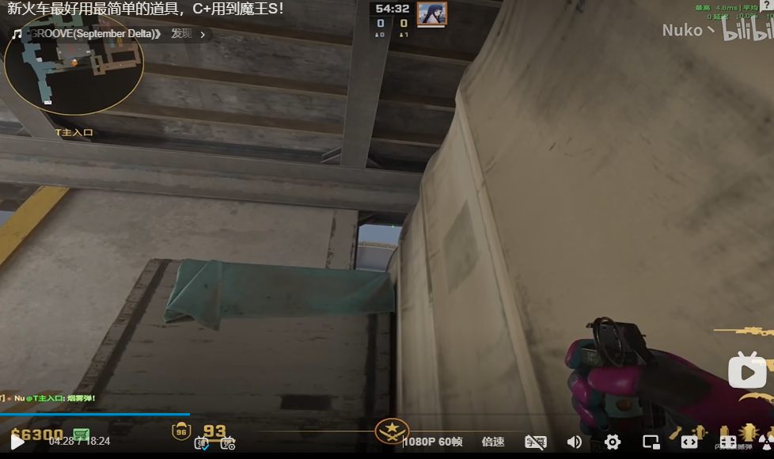
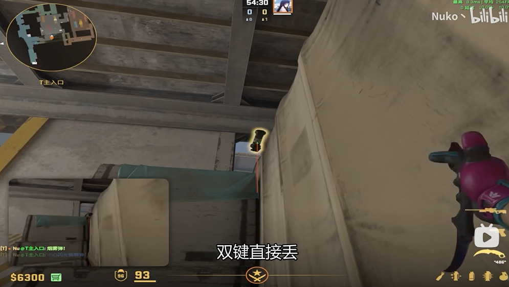
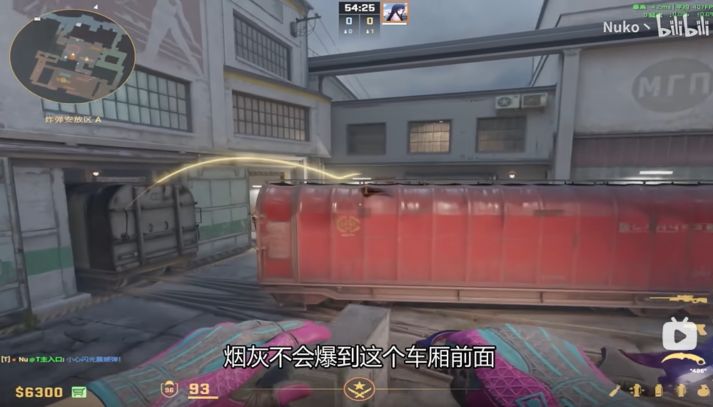

# de_train-T-Flashbang🌟

### 1. 闪 匪口->内场

跳投

#### 1.1. 效果

### 2. 闪 匪口->内场

跳投

#### 2.1. 效果 

### 3. 闪 红楼梯->电箱

单向

#### 3.1. 效果

### 4. 闪 匪口->匪口外 第二时间出匪口用 
瞄上方有个小黑点

双键投 

#### 4.1. 效果

单向